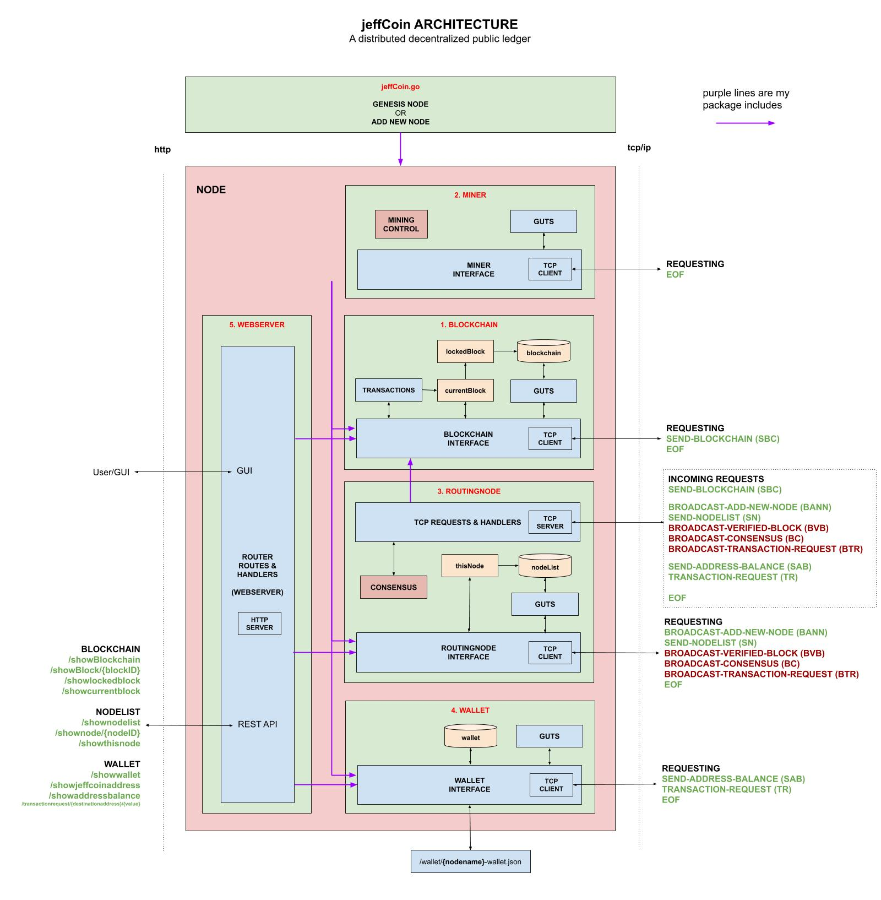
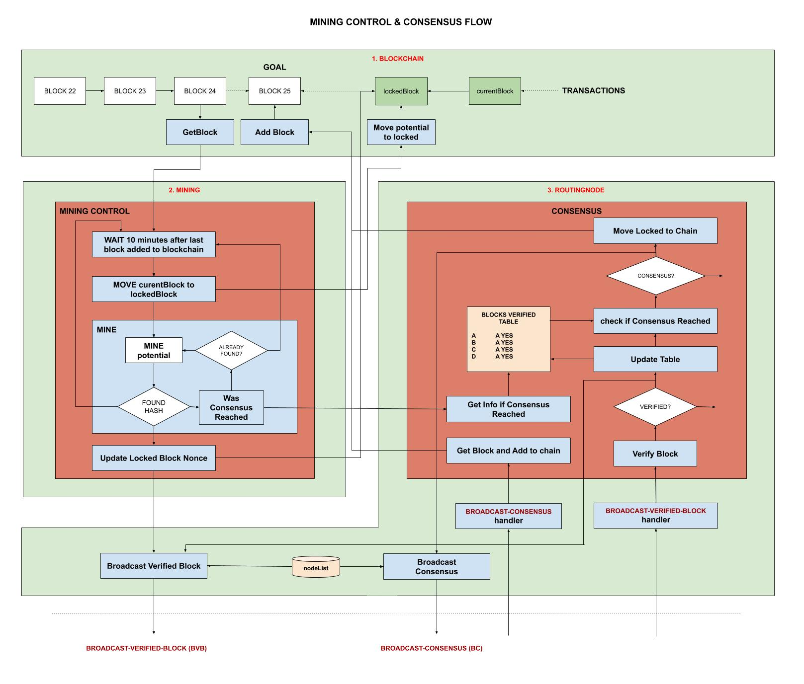
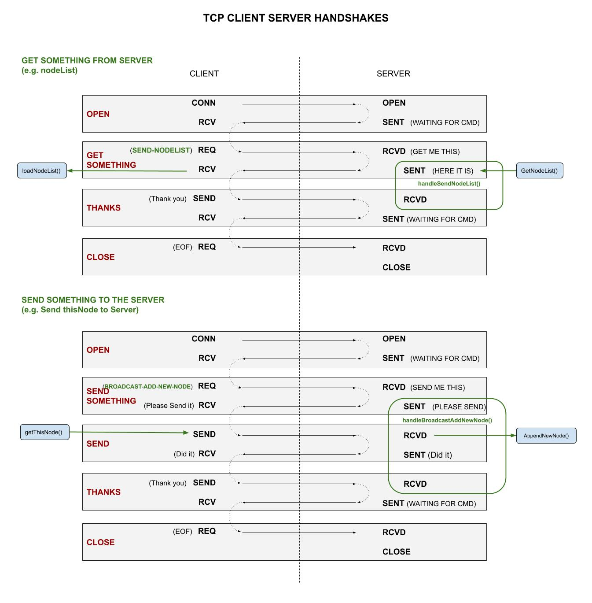

# jeffCoin

```text
*** THE REPO IS UNDER CONSTRUCTION - CHECK BACK SOON ***
```

[](https://goreportcard.com/report/github.com/JeffDeCola/jeffCoin)
[](https://godoc.org/github.com/JeffDeCola/jeffCoin)
[](https://codeclimate.com/github/JeffDeCola/jeffCoin/maintainability)
[](https://codeclimate.com/github/JeffDeCola/jeffCoin/issues)
[](http://jeffdecola.mit-license.org)

_A cryptocurrency (transaction based data) built on decentralized
multi-node P2P open Network using a sha256 Proof of Work (PoW) blockchain
with a REST JSON API and a TCP Server to communicate between
the Nodes over IP._

Or more simply, **a distributed decentralized public ledger.**

Table of Contents,

* [PREREQUISITES](https://github.com/JeffDeCola/jeffCoin#prerequisites)
* [OVERVIEW](https://github.com/JeffDeCola/jeffCoin#overview)
* [1. BLOCKCHAIN](https://github.com/JeffDeCola/jeffCoin#1-blockchain)
  * [1.1 BLOCKCHAIN](https://github.com/JeffDeCola/jeffCoin#11-blockchain)
  * [1.2 TRANSACTIONS](https://github.com/JeffDeCola/jeffCoin#12-transactions)
* [2. MINER](https://github.com/JeffDeCola/jeffCoin#2-miner)
* [3. ROUTINGNODE](https://github.com/JeffDeCola/jeffCoin#3-routingnode)
  * [3.1 NODELIST](https://github.com/JeffDeCola/jeffCoin#31-nodelist)
  * [3.2 TCP REQUESTS & HANDLERS](https://github.com/JeffDeCola/jeffCoin#32-tcp-requests--handlers)
* [4. WALLET](https://github.com/JeffDeCola/jeffCoin#4-wallet)
* [5. WEBSERVER](https://github.com/JeffDeCola/jeffCoin#5-webserver)
  * [5.1 GUI](https://github.com/JeffDeCola/jeffCoin#51-gui)
  * [5.2 REST API](https://github.com/JeffDeCola/jeffCoin#52-rest-api)
* [RUN](https://github.com/JeffDeCola/jeffCoin#run)
  * [GENESIS NODE](https://github.com/JeffDeCola/jeffCoin#genesis-node)
  * [ADDING NEW NODES](https://github.com/JeffDeCola/jeffCoin#adding-new-nodes)
  * [WEBSERVER AND API](https://github.com/JeffDeCola/jeffCoin#webserver-and-api)
  * [ROUTINGNODE](https://github.com/JeffDeCola/jeffCoin#routingnode)
* [RUN ON GOOGLE COMPUTE ENGINE (GCE) (OPTIONAL)](https://github.com/JeffDeCola/jeffCoin#run-on-google-compute-engine-gce-optional)

This project was built from some of my other projects,

* The **BLOCKCHAIN** is built from my
  [single-node-blockchain-with-REST](https://github.com/JeffDeCola/my-go-examples/tree/master/blockchain/single-node-blockchain-with-REST)
  * The **BLOCKCHAIN TRANSACTIONS** is built from my
    [bitcoin-ledger](https://github.com/JeffDeCola/my-go-examples/tree/master/blockchain/bitcoin-ledger)
  * The ecdsa signature verification from my
    [ecdsa-digital-signature](https://github.com/JeffDeCola/my-go-examples/tree/master/cryptography/asymmetric-cryptography/ecdsa-digital-signature)
* The **ROUTINGNODE** (TCP Server) is built from my
  [simple-tcp-ip-server](https://github.com/JeffDeCola/my-go-examples/tree/master/api/simple-tcp-ip-server)
* The **WALLET** for generating keys and creating the jeffCoin address
  is built from my
  [create-bitcoin-address-from-ecdsa-publickey](https://github.com/JeffDeCola/my-go-examples/tree/master/blockchain/create-bitcoin-address-from-ecdsa-publickey)
* The **WEBSERVER** (GUI & REST JSON API) is built from my
  [simple-webserver-with-REST](https://github.com/JeffDeCola/my-go-examples/tree/master/api/simple-webserver-with-REST)
* Other projects I used are my
  [errors](https://github.com/JeffDeCola/my-go-examples/tree/master/packages/errors),
  [logrus](https://github.com/JeffDeCola/my-go-examples/tree/master/packages/logrus),
  and
  [flag](https://github.com/JeffDeCola/my-go-examples/tree/master/packages/flag)
projects.

Documentation and reference,

* Refer to my
  [cheat sheet on blockchains](https://github.com/JeffDeCola/my-cheat-sheets/tree/master/software/development/software-architectures/blockchain/blockchain-cheat-sheet)
* I got a lot of inspiration
  [here](https://github.com/nosequeldeebee/blockchain-tutorial)

[GitHub Webpage](https://jeffdecola.github.io/jeffCoin/)

## PREREQUISITES

```bash
go get -v -u github.com/btcsuite/btcutil/base58
go get -v -u golang.org/x/crypto/ripemd160
go get -u -v github.com/gorilla/mux
go get -u -v github.com/sirupsen/logrus
go get -u -v github.com/pkg/errors
```

## OVERVIEW

`jeffCoin` (JEFC) is my interpretation of a transaction based (ledger) using a blockchain.
This is a work in progress I feel can be used as a foundation to
build bigger and better things.

Coins (a.k.a jeffCoins) are minted as follows,

* A grand total of **1,000,000 jeffCoins**
* The blockchain will not store jeffCoins but **addies** which are
  1/1000 of a jeffCoin (.001 JEFC).
* The founders wallet will start with **100,000 jeffCoins (100,000,000 addies)**
  (10% of all jeffCoins)
* Rewards **1 jeffCoin (1000 addies) every 10 minutes**
  _(144 jeffCoins/day or 52,560 jeffCoins/year)_
* Will take **17.12 years to mint all the jeffCoins**
  _(900,000/52,560 = 17.12)_

jeffCoin uses the following technology,

* Written in golang
* Implements a blockchain using a sha256 hash
* A decentralized multi-node P2P architecture maintaining a Network of Nodes
* A Webserver with both a GUI and a REST API
* A TCP Server for inter-node communication
* ECDSA Private & Public Key generation
* Creates a jeffCoin Address from the ECDSA Public Key _(Just like bitcoin)_
* ECDSA Digital Signature Verification
* Mining uses Proof of Work (PoW)
* Transaction as stored using the unspent transaction output model

What jeffCoin does not have,

* No database, so if the entire Network dies, the chain dies
* Rigorous testing of all corner cases

The following illustration shows how the code is broken up into five main areas,

* [1. BLOCKCHAIN](https://github.com/JeffDeCola/jeffCoin#1-blockchain)
  The blockchain and transactions
* [2. MINER](https://github.com/JeffDeCola/jeffCoin#2-miner)
  To mine the cryptocurrency using PoW
* [3. ROUTINGNODE](https://github.com/JeffDeCola/jeffCoin#3-routingnode)
  To maintain a list of nodes & communicate between (Network)
* [4. WALLET](https://github.com/JeffDeCola/jeffCoin#4-wallet)
  To create an jeffCoin Address and keep the private Keys
* [5. WEBSERVER](https://github.com/JeffDeCola/jeffCoin#5-webserver)
  The API and GUI



## 1. BLOCKCHAIN

The blockchain section is the heart of the entire design. It will keep the
transactions secure. A transaction is a transfer of value (jeffCoins) between
jeffCoin Addresses.
Like bitcoin, the value (jeffCoins) is contained in the ledger.
The wallets just hold the public/private keys to request a transaction.

This blockchain section has two main parts, the blockchain and the transactions
(the data on the blockchain).

### 1.1 BLOCKCHAIN

This blockchain is built from my
[single-node-blockchain-with-REST](https://github.com/JeffDeCola/my-go-examples/tree/master/blockchain/single-node-blockchain-with-REST).

**[BLOCKCHAIN-DATASTRUCTURES](https://github.com/JeffDeCola/jeffCoin/blob/master/blockchain/blockchain-datastructures.go)**

A block in the blockchain is the following go struct,

```go
type blockStruct struct {
    Index        int                 `json:"index"`
    Timestamp    string              `json:"timestamp"`
    Transactions []transactionStruct `json:"transactions"`
    Hash         string              `json:"hash"`
    PrevHash     string              `json:"prevhash"`
    Difficulty   int                 `json:"difficulty"`
    Nonce        string              `json:"nonce"`
}
```

The states of a block are,

* **pendingBlock** Receiving transactions and not part of blockchain
* **lockedBlock** To be mined and added to the blockchain
* **Part of Chain** Already in the **blockchain**

**[BLOCKCHAIN-INTERFACE FUNCTIONS](https://github.com/JeffDeCola/jeffCoin/blob/master/blockchain/blockchain-interface.go)**

* BLOCKCHAIN
  * **GetBlockchain()**
    _Gets the blockchain_
  * **GenesisBlockchain()**
    _Creates the blockchain_
  * **RequestBlockchain()**
    _Requests the blockchain and the pendingBlock from a Network Node_
    * `SEND-BLOCKCHAIN Request`
* BLOCK
  * **GetBlock()**
    _Gets a block (via Index number) from the blockchain_
* LOCKED BLOCK
  * **GetLockedBlock()**
    _Gets the lockedBlock_
* PENDING BLOCK
  * **GetPendingBlock()**
    _Gets the pendingBlock_
  * **AddTransactionToPendingBlock()**
    _Adds a transaction to the pendingBlock_
* JEFFCOINS
  * **GetAddressBalance()**
    _Gets the jeffCoin Address balance_
* TRANSACTIONS
  * **TransactionRequest()**
    _Request to transfer jeffCoins to a jeffCoin Address_

**[GUTS FUNCTIONS](https://github.com/JeffDeCola/jeffCoin/blob/master/blockchain/guts.go)**

* BLOCKCHAIN
  * **getBlockchain()**
    _Gets the blockchain_
  * **loadBlockchain()**
    _Loads the entire blockchain_
  * **replaceBlockchain()**
    _Replaces blockchain with the longer one_
* BLOCK
  * **getBlock()**
    _Gets a block in the blockchain_
  * **calculateBlockHash()**
    _Calculates SHA256 hash on a block_
  * **isBlockValid()**
    _Checks if block is valid_
* LOCKED BLOCK
  * **getLockedBlock()**
    _Gets the lockedBlock_
  * **appendLockedBlock()**
    _Appends the lockedBlock to the blockchain_
* PENDING BLOCK
  * **getPendingBlock()**
    _Gets the pendingBlock_
  * **loadPendingBlock()**
    _Loads the pendingBlock_
  * **resetPendingBlock()**
    _Resets the pendingBlock_
  * **addTransactionToPendingBlock()**
    _Adds a transaction to the pendingBlock_
  * **lockPendingBlock()**
    _Moves the pendingBlock to the lockedBlock and resets the pendingBlock_
* JEFFCOINS
  * **getAddressBalance()**
    _Gets the jeffCoin Address balance_

### 1.2 TRANSACTIONS

Transaction are at the heart of jeffCoin, allowing the transfer of value (jeffCoins)
from one jeffCoin Address to another.
A transaction request comes from the wallet which holds
the private key. All transaction requests are broadcast to the entire Network
before it is validated. Each Node does its own Proof of Work (PoW).

The transactions are stored in the block using the
**unspent transaction output model**.
Basically a chain of ledger transactions.

This was built using my
ecdsa signature verification from
[ecdsa-digital-signature](https://github.com/JeffDeCola/my-go-examples/tree/master/cryptography/asymmetric-cryptography/ecdsa-digital-signature)
and the transaction ledger was built from my
[bitcoin-ledger](https://github.com/JeffDeCola/my-go-examples/tree/master/blockchain/bitcoin-ledger).

**[BLOCKCHAIN-DATASTRUCTURES](https://github.com/JeffDeCola/jeffCoin/blob/master/blockchain/blockchain-datastructures.go)**

A transaction for a block is the following go struct,

```go
type transactionStruct struct {
    ID      int64            `json:"id"`
    Inputs  []txInputStruct  `json:"inputs"`
    Outputs []txOutputStruct `json:"outputs"`
}

type txInputStruct struct {
    TXID          int64  `json:"txID"`
    ReferenceTXID int64  `json:"referenceTXID"`
    Signature     string `json:"signature"`
}

type txOutputStruct struct {
    JeffCoinAddress string `json:"jeffCoinAddress"`
    Value           int64  `json:"value"`
}
```

**[TRANSACTION FUNCTIONS](https://github.com/JeffDeCola/jeffCoin/blob/master/blockchain/transactions.go)**

* TRANSACTIONS
  * **processTxRequestMessage()**
    _Request to transfer jeffCoins to a jeffCoin Address_
* SIGNATURE
  * **verifySignature()**
    _Verifies a ECDSA Digital Signature_

This illustration shows transaction requests, verification for that request
and addition onto the pendingBlock. A transaction is never valid until
the transaction is added onto the blockchain.


## 2. MINER

The miner section has the following features,

* Miner automatically tells blockchain-interface to place
  pendingBlock into lockedBlock
* Performs the `mining (poW)` on the lockedBlocked
* Difficulty is how many zero are needed at the beginning of the hash
* When block is solved, broadcast block to entire Network to check for `consensus`

**[MINER-DATASTRUCTURES](https://github.com/JeffDeCola/jeffCoin/blob/master/miner/miner-datastructures.go)**

The proof of work structure is,

```go
type tbd struct {
    tbd
}
```

**[MINER-INTERFACE FUNCTIONS](https://github.com/JeffDeCola/jeffCoin/blob/master/miner/miner-interface.go)**

* MINING
  * **tbd()**
    _tbd_

**[GUTS FUNCTIONS](https://github.com/JeffDeCola/jeffCoin/blob/master/miner/guts.go)**

* MINING
  * **tbd()**
    _tbd_



## 3. ROUTINGNODE

The Routingnode section has two main parts, the nodeList
and the ability to handle the Node TCP Requests (TCP Server).
The nodeList keeps a listing of all Nodes in the Network.
The TCP Server handles requests from other Nodes.

The routingnode is built from my
[simple-tcp-ip-server](https://github.com/JeffDeCola/my-go-examples/tree/master/api/simple-tcp-ip-server).

### 3.1 NODELIST

**[ROUTINGNODE-DATASTRUCTURES](https://github.com/JeffDeCola/jeffCoin/blob/master/routingnode/routingnode-datastructures.go)**

A Node in the nodeList is the following go struct,

```go
type nodeStruct struct {
    Index       int    `json:"index"`
    Status      string `json:"status"`
    Timestamp   string `json:"timestamp"`
    NodeName    string `json:"nodename"`
    ToolVersion string `json:"toolversion"`
    IP          string `json:"ip"`
    HTTPPort    string `json:"httpport"`
    TCPPort     string `json:"tcpport"`
}
```

**[ROUTINGNODE-INTERFACE FUNCTIONS](https://github.com/JeffDeCola/jeffCoin/blob/master/routingnode/routingnode-interface.go)**

* NODELIST
  * **GetNodeList()**
    _Gets the nodeList_
  * **GenesisNodeList()**
    _Creates the nodeList_
  * **RequestsNodeList()**
    _Requests the nodeList from a Network Node_
    * `SEND-NODELIST Request`
* NODE
  * **GetNode()**
    _Gets a Node (via Index number) from the nodeList_
  * **AppendNewNode()**
    _Appends a new Node to the nodeList_
* THIS NODE
  * **GetThisNode()**
    _Gets thisNode_
  * **LoadThisNode()**
    _Loads thisNode_
  * **AppendThisNode()**
    _Appends thisNode to the nodeList_
  * **BroadcastThisNode()**
    _Broadcasts thisNode to the Network_
    * `BROADCAST-ADD-NEW-NODE Request`

**[GUTS FUNCTIONS](https://github.com/JeffDeCola/jeffCoin/blob/master/routingnode/guts.go)**

* NODELIST
  * **getNodeList()**
    _Gets the nodeList_
  * **loadNodeList()**
    _Loads the entire nodeList_
* NODE
  * **getNode()**
    _Gets a Node in the nodeList_
  * **appendNewNode()**
    _Appends a new Node to the nodeList_
* THIS NODE
  * **getThisNode()**
    _Gets thisNode_
  * **loadThisNode()**
    _Loads thisNode_
  * **appendThisNode()**
    _Appends thisNode to the nodeList_
  * **checkIfThisNodeinNodeList()**
    _Check if thisNode is already in the nodeList_

### 3.2 TCP REQUESTS & HANDLERS

Incoming requests to the TCP server from other Nodes or TCP connection.

An illustration of client-server handshakes,



**[HANDLERS](https://github.com/JeffDeCola/jeffCoin/blob/master/routingnode/handlers.go)**

* FROM BLOCKCHAIN I/F
  * **handleSendBlockchain()**
    _SEND-BLOCKCHAIN - Sends the blockchain and pendingBlock to another Node_
* FROM ROUTINGNODE I/F
  * **handleBroadcastAddNewNode()**
    _BROADCAST-ADD-NEW-NODE (BANN) - Adds a Node to the nodeList_
  * **handleSendNodeList()**
    _SEND-NODELIST (SNL) - Sends the nodeList to another Node_
  * **handleBroadcastVerifiedBlock()**
    _BROADCAST-VERIFIED-BLOCK (BVB) - A Node verified the next block,
    get block and verify_
  * **handleBroadcastConsensus()**
    _BROADCAST-CONSENSUS (BC) - 51% Consensus reached, get block to add to blockchain_
  * **handleBroadcastTransactionRequest()**
    _BROADCAST-TRANSACTION-REQUEST (BTR) - Request from a Node
    to transfer jeffCoins to a jeffCoin Address_
* FROM WALLET I/F
  * **handleSendAddressBalance()**
    _SEND-ADDRESS-BALANCE (SAB) - Sends the jeffCoin balance
    for a jeffCoin Address_
  * **handleTransactionRequest()**
    _TRANSACTION-REQUEST (TR) - Request from Wallet to transfer jeffCoins
    to a jeffCoin Address_
* EOF
  * **EOF**
    _Close Connection_

## 4. WALLET

The wallet section holds the Public Key, the Private Key and the jeffCoin Address.
Like bitcoin, wallets do not have or hold any jeffCoins.
The jeffCoins are in the blockchain transactions (ledger).

Generating keys and creating the jeffCoin address is built from my
[create-bitcoin-address-from-ecdsa-publickey](https://github.com/JeffDeCola/my-go-examples/tree/master/blockchain/create-bitcoin-address-from-ecdsa-publickey).

Your wallet will be saved in the following file based on your nodename,
`/wallet/{nodename}-wallet.json`.

**[WALLET-DATASTRUCTURES](https://github.com/JeffDeCola/jeffCoin/blob/master/wallet/wallet-datastructures.go)**

A wallet has the following go struct,

```go
type walletStruct struct {
    PrivateKeyHex   string `json:"privateKeyHex"`
    PublicKeyHex    string `json:"publicKeyHex"`
    JeffCoinAddress string `json:"jeffCoinAddress"`
}
```

**[WALLET-INTERFACE FUNCTIONS](https://github.com/JeffDeCola/jeffCoin/blob/master/wallet/wallet-interface.go)**

* WALLET
  * **GetWallet()**
    _Gets the wallet_
  * **GenesisWallet()**
    _Creates the wallet and writes to file (Keys and jeffCoin Address)_
  * **ReadWalletFile()**
    _Reads the wallet from a file_
* KEYS
  * **EncodeKeys()**
    _Encodes privateKeyRaw & publicKeyRaw to privateKeyHex & publicKeyHex_
  * **DecodeKeys()**
    _Decodes privateKeyHex & publicKeyHex to privateKeyRaw & publicKeyRaw_
* JEFFCOINS
  * **RequestAddressBalance()**
    _Requests the jeffCoin balance for a jeffCoin Address_
    * `SEND-ADDRESS-BALANCE Request`
  * **TransactionRequest()**
    _Request to transfer jeffCoins to a jeffCoin Address_
    * `TRANSACTION-REQUEST Request`
* SIGNATURE
  * **CreateSignature()**
    _Creates a ECDSA Digital Signature_

**[GUTS FUNCTIONS](https://github.com/JeffDeCola/jeffCoin/blob/master/wallet/guts.go)**

* WALLET
  * **getWallet()**
    _Gets the wallet_
  * **makeWallet()**
    _Creates the wallet and writes to file (Keys and jeffCoin Address)_
  * **readWalletFile()**
    _Reads the wallet from a file_
* KEYS
  * **generateECDSASKeys()**
    _Generate privateKeyHex and publicKeyHex_
  * **encodeKeys()**
    _Encodes privateKeyRaw & publicKeyRaw to privateKeyHex & publicKeyHex_
  * **decodeKeys()**
    _Decodes privateKeyHex & publicKeyHex to privateKeyRaw & publicKeyRaw_
* JEFFCOIN ADDRESS
  * **generateJeffCoinAddress()**
    _Creates a jeffCoin Address_
  * **hashPublicKey()**
    _Hashes publicKeyHex_
  * **checksumKeyHash()**
    _Checksums verPublicKeyHash_
  * **encodeKeyHash()**
    _Encodes verPublicKeyHash & checkSum_
* SIGNATURE
  * **createSignature()**
    _Creates a ECDSA Digital Signature_

## 5. WEBSERVER

The webserver section has two main parts, the GUI and the REST API.

This webserver is built from my
[simple-webserver-with-REST](https://github.com/JeffDeCola/my-go-examples/tree/master/api/simple-webserver-with-REST).

### 5.1 GUI

Currently, there is the main page that also lists the available APIs.

* [192.168.20.100:1234](http://192.168.20.100:1234)

### 5.2 REST API

**[API COMMANDS](https://github.com/JeffDeCola/jeffCoin/blob/master/webserver/handlers.go)**

* BLOCKCHAIN
  * **/showBlockchain**
  * **/showBlock/{blockID}**
  * **/showlockedblock**
  * **/showpendingblock**
* NODELIST
  * **/shownodelist**
  * **/shownode/{nodeID}**
  * **/showthisnode**
* WALLET (THIS NODE)
  * **/showwallet**
  * **/showjeffcoinaddress**
  * **/showbalance**
  * **/transactionrequest/{destinationaddress}/{value}**
* WALLET (OTHER)
  * **/showaddressbalance/{jeffcoinaddress}**

## RUN

If this is you first time running, you need to create the first Node (Genesis Node).
You only do this once. You can set the log level to info to cut down on the amount
of logs.

### GENESIS NODE

```bash
go run jeffCoin.go \
       -loglevel trace \
       -genesis \
       -nodename Founders \
       -ip 192.168.20.100 \
       -httpport 1234 \
       -tcpport 3334
```

This will created the founders Node.

### ADDING NEW NODES

To hook up to the Network.  You need the ip of any
working Network Node.

Adding a second Node in the network can look like,

```bash
go run jeffCoin.go \
       -loglevel trace \
       -nodename Jeffry \
       -ip 192.168.20.100 \
       -httpport 1235 \
       -tcpport 3335 \
       -netip 192.168.20.100 \
       -netport 3334
```

Adding a third Node,

```bash
go run jeffCoin.go \
       -loglevel trace \
       -nodename Larry \
       -ip 192.168.20.100 \
       -httpport 1236 \
       -tcpport 3336 \
       -netip 192.168.20.100 \
       -netport 3335
```

### WEBSERVER AND API

The user GUI for all 3 Nodes,

[192.168.20.100:1234](http://192.168.20.100:1234/)

[192.168.20.100:1235](http://192.168.20.100:1235/)

[192.168.20.100:1236](http://192.168.20.100:1236/)

You could also use curl from the command line,

```go
curl 192.168.20.100:1234
```

The main page will list the various API commands.

For example, to show a particular block,

[192.168.20.100:1234//showblock/0](http://192.168.20.100:1234/showblock/0)

### ROUTINGNODE

You can also bypass the API and just open a connection to the TCP server itself,

```txt
netcat -q -1 192.168.20.100 3334
```

And request commands such as,

```txt
SEND-ADDRESS-BALANCE
```

## RUN ON GOOGLE COMPUTE ENGINE (GCE) (OPTIONAL)

Make sure your create a firewall rule and have your instance use
it as a network tag,

```bash
gcloud compute firewall-rules create jeffs-firewall-settings-rule \
    --action allow \
    --rules tcp:1234,tcp:3334 \
    --priority 1000 \
    --source-ranges 0.0.0.0/0 \
    --target-tags "jeffs-firewall-settings" \
    --description "Jeffs firewall rules"
```

The IP `0.0.0.0` gets forwarded to your external IP, hence I added a
`-gce switch` to deal with this,

```bash
go run jeffCoin.go \
       -gce \
       -loglevel trace \
       -genesis \
       -nodename Founders \
       -ip 35.203.189.193 \
       -httpport 1234 \
       -tcpport 3334
```

Add another node (not at gce) with,

```bash
go run jeffCoin.go \
       -loglevel trace \
       -nodename Jeffry \
       -ip 192.168.20.100 \
       -httpport 1235 \
       -tcpport 3335 \
       -netip 35.203.189.193 \
       -netport 3334
```

I have a gce build example
[here](https://github.com/JeffDeCola/my-packer-image-builds#jeffs-gce-ubuntu-1904-xxxx).

## UPDATE GITHUB WEBPAGE USING CONCOURSE (OPTIONAL)

For fun, I use concourse to update
[jeffCoin GitHub Webpage](https://jeffdecola.github.io/jeffCoin/)
and alert me of the changes via repo status and slack.

A pipeline file [pipeline.yml](https://github.com/JeffDeCola/jeffCoin/tree/master/ci/pipeline.yml)
shows the entire ci flow. Visually, it looks like,


The `jobs` and `tasks` are,

* `job-readme-github-pages` runs task
  [readme-github-pages.sh](https://github.com/JeffDeCola/jeffCoin/tree/master/ci/scripts/readme-github-pages.sh).

The concourse `resources types` are,

* `jeffCoin` uses a resource type
  [docker-image](https://hub.docker.com/r/concourse/git-resource/)
  to PULL a repo from github.
* `resource-slack-alert` uses a resource type
  [docker image](https://hub.docker.com/r/cfcommunity/slack-notification-resource)
  that will notify slack on your progress.
* `resource-repo-status` uses a resource type
  [docker image](https://hub.docker.com/r/dpb587/github-status-resource)
  that will update your git status for that particular commit.

For more information on using concourse for continuous integration,
refer to my cheat sheet on [concourse](https://github.com/JeffDeCola/my-cheat-sheets/tree/master/software/operations-tools/continuous-integration-continuous-deployment/concourse-cheat-sheet).
